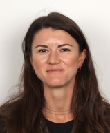

<link rel="stylesheet" href="styles.css">

<nav class="cv-tabs" aria-label="Sections">
  <a href="#cv">CV</a>
  <a href="#publications">Publications</a>
  <a href="#talks">Talks</a>
</nav>

  <aside class="cv-sidebar">
    

      
    

    

      <a class="icon-button" href="https://github.com/juliala2504" aria-label="GitHub">
        
      </a>
      <a class="icon-button" href="https://www.linkedin.com/in/julia-lamprecht-49bb343b2" aria-label="LinkedIn">
        
      </a>
      <a class="icon-button" href="https://orcid.org/0009-0000-2790-9781" aria-label="ORCID">
        
      </a>
    

    

      <h2>Contact</h2>
      <ul class="contact-list">
        <li>Email<a href="mailto:lamprecht@sci.muni.cz">lamprecht@sci.muni.cz</a></li>
        <li>GitHub<a href="https://github.com/juliala2504">juliala2504</a></li>
        <li>LinkedIn<a href="https://www.linkedin.com/in/julia-lamprecht-49bb343b2">julia-lamprecht-49bb343b2</a></li>
        <li>ORCID<a href="https://orcid.org/0009-0000-2790-9781">0009-0000-2790-9781</a></li>
        <li>LocationBrno, Czech Republic</li>
      </ul>
    

    

      <h2>Profile</h2>
      
PhD Student in Astrophysics at Masaryk University, Brno.

      
Research: Bridging Dynamics and Stellar Populations: Unraveling Nuclear Star Cluster Formation.

      
German and Italian citizenship.

    

    

      <h2>Languages</h2>
      <ul class="compact-list">
        <li>German - Mother tongue</li>
        <li>English - Proficient (C1)</li>
        <li>French - Basic (A2)</li>
        <li>Italian - Basic (A2)</li>
        <li>Spanish - Basic (A2)</li>
      </ul>
    

    

      <h2>Interests</h2>
      
The climate and biodiversity crisis, (thru-)hiking, yoga, running, climbing, and time outdoors in the mountains. Foodsaving and -sharing.

    

  </aside>

  <main class="cv-main" id="cv">
    <header class="cv-header">
      <h1>Julia Katharina Lamprecht</h1>
      
PhD Student in Astrophysics

    </header>

    <section>
      <h2>Education</h2>
      

        

          Masaryk University, Brno
          10/2025 - now
        

        
PhD Student. Title: Bridging Dynamics and Stellar Populations: Unraveling Nuclear Star Cluster Formation.

      

      

        

          University of Vienna, Department of Astrophysics
          08/2023 - 07/2025
        

        
MSc Astronomy. Focus: Evolution and formation of galaxies, Galactic dynamics, Dynamical modeling of galaxies, SMBH mass determination. Thesis: Orbital decomposition of the nuclear star cluster in FCC 047.

      

      

        

          University of Vienna, Department of Astrophysics
          10/2019 - 08/2023
        

        
BSc Astronomy. Thesis: Constraining the black hole mass of PGC1021091 with DYNAMITE.

      

      

        

          Universite Toulouse 1 Capitole, School of Economics
          08/2016 - 01/2017
        

        
BSc Economics.

      

      

        

          Ludwig-Maximilians-Universitat Munich
          10/2014 - 04/2018
        

        
BSc Economics.

      

    </section>

    <section>
      <h2>Research Focus</h2>
      <ul class="compact-list">
        <li>Dynamics of early-type galaxies</li>
        <li>Schwarzschild dynamical modelling (DYNAMITE)</li>
        <li>Stellar kinematics (Bayes-LOSVD, pPXF)</li>
        <li>Measuring the mass of supermassive black holes (SMBHs)</li>
        <li>Nuclear star clusters (NSCs) and their formation</li>
        <li>Spectroscopy (MUSE, SINFONI, NIFS), HST photometry</li>
      </ul>
    </section>

    <section id="talks">
      <h2>Talks</h2>
      

        

          Traces of Galaxy Formation Group, La Laguna, Tenerife
          November 2025
        

        
Talk on Testing Bayes-LOSVD on nucleated early-type galaxies in the Fornax cluster.

      

      

        

          Lorentz Center workshop: Galactic Centers as tracers of Galaxy Evolution, Leiden
          October 2025
        

        
Talk on An orbital decomposition of the nuclear regions in the early-type galaxy FCC047.

      

      

        

          Bridging Scales Conference, Matera
          September 2025
        

        
Flashtalk on An orbital decomposition of an unusually large nuclear star cluster.

      

      

        

          European Southern Observatory (ESO), Garching
          2025, 2024
        

        
01/2025 - 02/2025: Science internship program. 10/2024 - 11/2024: Research visit.

      

      

        

          Stellar Dynamics Research Group, Vienna
          May 2023
        

        
Talk on Measuring the black hole mass of PGC1021091.

      

      

        

          WST Symposium, Vienna
          May 2023
        

        
Student support in Local Organizing Committee.

      

    </section>

    <section id="publications">
      <h2>Publications</h2>
      
Selected publications and updated list available on ORCID: <a href="https://orcid.org/0009-0000-2790-9781">0009-0000-2790-9781</a>.

    </section>

    <section>
      <h2>Work Experience</h2>
      

        

          NGO Light for the World, Vienna
          02/2023 - 06/2025
        

        
Production Assistant. Focus: Direct Mailings and Committed Givers.

      

      

        

          Cafe Morgenstern (Vienna) and Elektro Gonner (Vienna)
          10/2019 - 08/2022
        

        
Service and Bar.

      

      

        

          Rodl and Partner GmbH Wirtschaftsprufungsgesellschaft
          01/2019 - 03/2019
        

        
Internship. International Tax Consulting, M and A Tax.

      

      

        

          Caceis Bank S.A. Investor Services
          09/2018 - 12/2018
        

        
Working Student. Business Implementation Support.

      

      

        

          Deloitte GmbH Wirtschaftsprufungsgesellschaft
          04/2018 - 07/2018
        

        
Internship. Risk Advisory, Regulatory Risk Consulting.

      

      

        

          KPMG AG Wirtschaftsprufungsgesellschaft
          02/2017 - 12/2017
        

        
Internships and Working Student. Financial Services, Compliance Consulting.

      

    </section>

    <section>
      <h2>Extracurricular Activities and Stipends</h2>
      

        

          Performance Scholarship, University of Vienna
          11/2025
        

        
Awarded for outstanding academic achievements.

      

      

        

          Stellar Dynamics Research Group, University of Vienna
          03/2023 - 06/2025
        

        
Group leader: Prof. Dr. Glen van de Ven.

      

      

        

          KWA (Short-term grant abroad), ESO
          10/2024 - 11/2024
        

        
Academic work abroad, working on the Master's thesis at ESO.

      

      

        

          WST Symposium, Vienna
          05/2023
        

        
Student support at the Local Organizing Committee.

      

      

        

          Nightingale Mentoring program
          10/2021 - 02/2022
        

        
Supporting children with migration background from socially disadvantaged families.

      

    </section>

    

      Last updated: {{ site.time | date: "%d %b %Y" }} -
      Made with GitHub Pages
    

  </main>

