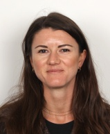

<link rel="stylesheet" href="styles.css">

  <aside class="cv-sidebar">
    

      
    

    

      <a class="icon-button" href="https://github.com/juliala2504" aria-label="GitHub">
        
      </a>
      <a class="icon-button" href="https://www.linkedin.com/in/julia-lamprecht-49bb343b2" aria-label="LinkedIn">
        
      </a>
      <a class="icon-button" href="https://orcid.org/0009-0000-2790-9781" aria-label="ORCID">
        
      </a>
    

    

      <h2>Contact</h2>
      <ul class="contact-list">
        <li>Mail<a href="mailto:lamprecht@sci.muni.cz">lamprecht@sci.muni.cz</a></li>
        <li>GitHub<a href="https://github.com/juliala2504">juliala2504</a></li>
        <li>LinkedIn<a href="https://www.linkedin.com/in/julia-lamprecht-49bb343b2">Julia Lamprecht</a></li>
        <li>ORCID ID<a href="https://orcid.org/0009-0000-2790-9781">0009-0000-2790-9781</a></li>
        <li>LocationVienna, Austria</li>
      </ul>
    

    

      <h2>Profile</h2>
      
PhD Student in Astrophysics at Masaryk University, Brno 

      
Research: Bridging Dynamics and Stellar Populations: Unraveling Nuclear Star Cluster Formation 

      
German and Italian citizenship 

    

    

      <h2>Languages</h2>
        
German - Mother tongue

        
English - Proficient (C1)

        
French, Spanish, Italien Basic (A2)

    

  </aside>

  <main class="cv-main">
    <header class="cv-header">
      <h1>Julia Katharina Lamprecht</h1>
      
PhD Student Astrophysics

    </header>

    <section>
      <h2>I care about ... </h2>
      <ul class="compact-list">
        <li>* The dynamics of early-type galaxies in order to constrain their formation and evolutionary history. Of particular interest are nucleated galaxies, as nuclear star clusters preserve information about their formation pathways imprinted into their stellar populations and dynamical structure </li>
        <li>* Using Schwarzschild orbit-superposition modelling (DYNAMITE), I build dynamical models of galaxies by optimizing large orbit libraries to reproduce integral-field spectroscopic and imaging observations (MUSE, SINFONI, NIFS, HST) </li>
        <li>* Extract stellar kinematics from integrated galaxy spectra using the Bayes-LOSVD framework, modelling the broadening and shifts of absorption-line features through Bayesian inference and Markov Chain Monte Carlo (MCMC) sampling within a probabilistic machine learning framework </li>
        <li>* Black hole demographics: Measuring the mass of BHs (SMBHs, IMBHs) to investigate co-existence and co-evolution of the central black hole and it's host galaxy </li>
        <li>*Data Science, scientific computing und statistical modeling</li>
      </ul>
    </section>

    <section>
      <h2>Visits and Talks</h2>
      

        

          Traces of Galaxy Formation Group, La Laguna, Tenerife
          11/2025
        

        
Talk on Testing Bayes-LOSVD on nucleated early-type galaxies in the Fornax cluster.

      

      

        

          Lorentz Center workshop: Galactic Centers as tracers of Galaxy Evolution, Leiden
          10/2025
        

        
Talk on An orbital decomposition of the nuclear regions in the early-type galaxy FCC047.

      

      

        

          Bridging Scales Conference, Matera
          09/2025
        

        
Flashtalk on An orbital decomposition of an unusually large nuclear star cluster.

      

      

        

          European Southern Observatory (ESO), Garching
          2024 and 2025
        

        
01/2025 - 02/2025: Science internship program.
        10/2024 - 11/2024: Research visit.

      

      

        

          Stellar Dynamics Research Group, Vienna
          05/2023
        

        
Talk on Measuring the black hole mass of PGC1021091.

      

    </section>

    <section>
      <h2>Education</h2>
      

        

          Department of Astrophysics and theoretical Physics, Masaryk University, Brno
          07/2025 - now
        

        
PhD Student: Bridging Dynamics and Stellar Populations: Unraveling Nuclear Star Cluster Formation.

      

      

        

          Department of Astrophysics, University of Vienna
           2019 - 2025
        

        
BSc and MSc degrees. Focus: Evolution and formation of galaxies, Galactic dynamics, Dynamical modelling of galaxies, SMBH mass determination. 
        Masterthesis: Orbital decomposition of the nuclear star cluster in FCC 047. 
        Bachelorthesis: Constraining the black hole mass of PGC1021091 with DYNAMITE. 

      

      

        

          Faculty of Economics, Ludwig-Maximilians-University, Munich 
           2014 - 2018
        

        
BSc Economics.

        
Semester abroad at Universite Toulouse 1 Capitole, School of Economics (2016-2017). 

      

    </section>

    <section>
      <h2>Extracurricular Activities and Stipends</h2>
      

        

          Performance Scholarship, University of Vienna
          11/2025
        

        
Awarded for outstanding academic achievements.

      

      

        

          Stellar Dynamics Research Group, University of Vienna
          03/2023 - 06/2025
        

        
Group leader: Prof. Dr. Glen van de Ven.

      

      

        

          KWA (Short-term grant abroad), ESO
          10/2024 - 11/2024
        

        
Academic work abroad, working on the Master's thesis at ESO, Garching.

      

      

        

          WST Symposium, Vienna
          05/2023
        

        
Student support, Local Organizing Committee.

      

      

        

          Nightingale Mentoring program
          10/2021 - 02/2022
        

        
Supporting children with migration background from socially disadvantaged families.

      

    </section>

    

      Last updated: {{ site.time | date: "%d %b %Y" }} -
      Made with GitHub Pages
    

  </main>

